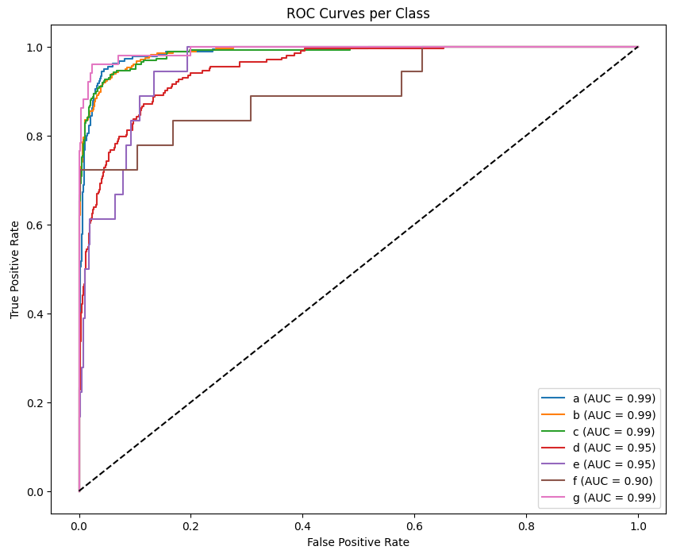
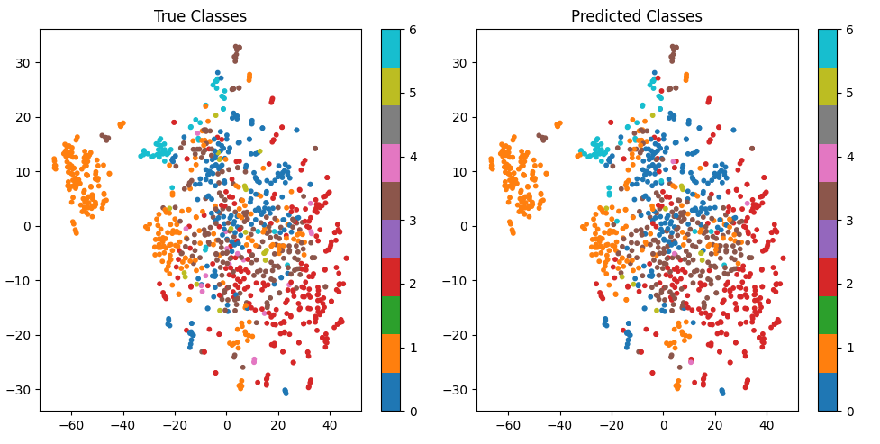
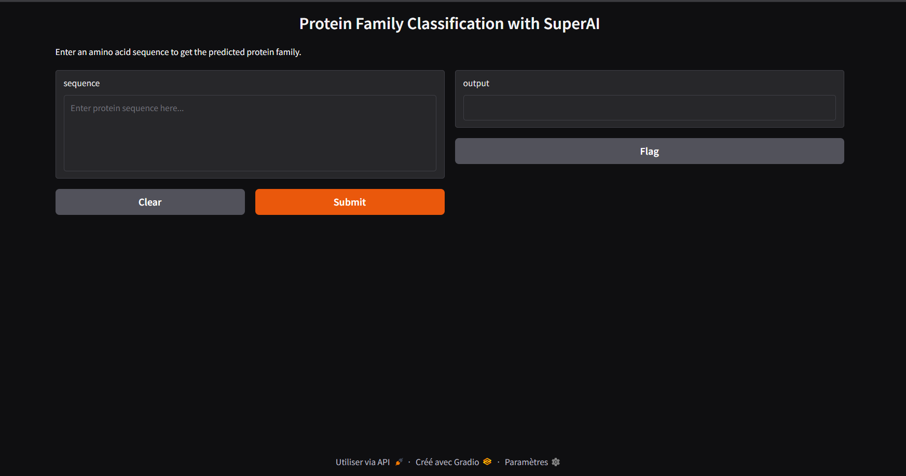

# miniAlphaFold-Protein-Family-Classification

This project focuses on classifying protein sequences into their respective SCOPe families using state-of-the-art protein embeddings and machine learning techniques.

## Project Overview

Protein family classification is a fundamental task in bioinformatics that helps understand protein functions, evolutionary relationships, and structural similarities. Traditional methods often rely on sequence alignment, which can be computationally expensive and less effective for distant homologs. 

In this project, we leverage recent advances in protein language models specifically the ESM-2 model developed by Facebook AI Research—to generate high-quality embeddings that capture the biological and structural features of protein sequences without explicit alignment.

## Key Components

### Data Preparation and Experimental Setup

We trained our models using protein sequences from the **Astral SCOPe 2.08 genetic domain sequence subsets**, which are based on **PDB SEQRES** records. This dataset provides curated protein sequences filtered by sequence identity thresholds to control redundancy and ensure robust evaluation:

- **Training/validation data:** sequences with less than **95% identity** to each other  
  This dataset subset contains closely related sequences but filters out near-identical copies, providing a broad but non-redundant training set.

- **Testing data:** sequences with less than **40% identity** to each other  
  This subset contains more diverse sequences, with low sequence identity, offering a challenging test set that evaluates the generalization ability of the models on distant homologs.

Our pipeline begins by extracting protein sequences from the SCOPe database, a widely used resource for hierarchical protein structural classification. We preprocess these sequences to extract meaningful labels such as SCOPe classes and families. Sequence filtering is applied to ensure high-quality inputs, which helps in achieving robust model performance across diverse protein families.

- **Embedding Generation with ESM-2:**  
  Using the ESM-2 pretrained transformer model, we convert protein sequences into dense, informative embeddings. Due to resource constraints, we work on a representative subset (~5-15%) of the full dataset to balance computational cost and performance.

- **Machine Learning Models:**  
  We experiment with multiple classifiers including:
  - **XGBoost:** A gradient boosting tree-based model known for its efficiency and interpretability.  
  - **Multilayer Perceptron (MLP):** A fully connected neural network trained on embeddings.  
  - **Convolutional Neural Networks (CNNs):** Designed to capture local patterns in the embeddings.

- **Performance Evaluation:**  
  Models are evaluated on metrics such as accuracy, precision, recall, and F1-score. Visualization techniques like t-SNE help illustrate the embedding space and class separability. Confusion matrices and ROC curves provide deeper insights into classification performance.

## Visualizations and Interface

### ROC Curves per Class

### True Classes vs Predicted Classes

### Web Interface for Protein Family Classification

## Model Performance (XGBoost trained on 14% of data)

The XGBoost classifier was trained on approximately 14% of the full dataset and evaluated on a validation set of 1000 samples. The detailed classification metrics per protein class are shown below:

| Class | Precision | Recall | F1-score | Support |
|-------|-----------|--------|----------|---------|
| a     | 0.86      | 0.90   | 0.88     | 180     |
| b     | 0.91      | 0.90   | 0.90     | 274     |
| c     | 0.89      | 0.91   | 0.90     | 257     |
| d     | 0.75      | 0.78   | 0.76     | 202     |
| e     | 0.75      | 0.17   | 0.27     | 18      |
| f     | 0.92      | 0.61   | 0.73     | 18      |
| g     | 0.88      | 0.86   | 0.87     | 51      |

**Overall metrics:**

- **Accuracy:** 0.86  
- **Macro Average:** Precision = 0.85, Recall = 0.73, F1-score = 0.76  
- **Weighted Average:** Precision = 0.86, Recall = 0.86, F1-score = 0.85

This demonstrates strong predictive performance on most classes, with some drop in recall for classes with fewer samples (e.g., class 'e').

- **Robustness Testing:**  
  We assess model generalization on independent test sets with reduced sequence similarity (e.g., 40% similarity threshold datasets) to evaluate robustness against overfitting.

- **Deployment Interface:**  
  A simple Gradio web interface allows users to input protein sequences and receive predicted SCOPe classes in real time, demonstrating practical applicability.

## Why This Approach?

Traditional sequence-based classification methods face limitations with large-scale data and distant evolutionary relationships. Embedding models like ESM-2 encode rich biological context and allow downstream classifiers to learn more discriminative features effectively. 

Among classifiers tested, XGBoost achieves comparable performance to deep learning models but with significantly smaller model size and faster inference times, making it suitable for deployment in resource-constrained environments.

## Requirements

- Python 3.7+  
- PyTorch  
- esm (Evolutionary Scale Modeling library)  
- scikit-learn  
- XGBoost  
- TensorFlow / Keras  
- Gradio (for web interface)  
- Biopython  

## How to Use

1. Clone the repository.  
2. Install the required dependencies listed in `requirements.txt`.  
3. Run the notebook to preprocess data, generate embeddings, train models, and evaluate results.  
4. Launch the Gradio interface to test predictions on custom protein sequences.

## Future Work

- Scale embedding generation to the full dataset with more computational resources.  
- Explore additional protein language models and ensemble approaches.  
- Integrate structural prediction outputs for multimodal classification.  
- Optimize model deployment for web and mobile applications.

---

This project serves as a proof-of-concept highlighting the power of protein language models combined with efficient machine learning for biological sequence classification.

